<!-- README.md is generated from README.Rmd. Please edit that file -->

```{r, include = FALSE}
knitr::opts_chunk$set(
  collapse = TRUE,
  comment = "#>",
  fig.path = "man/figures/README-",
  out.width = "100%"
)
```

# MexBrewer [](https://paezha.github.io/MexBrewer/)

<!-- badges: start -->
[](https://CRAN.R-project.org/package=MexBrewer)

[](https://lifecycle.r-lib.org/articles/stages.html#stable)

[](https://github.com/paezha/MexBrewer/stargazers)

  


<!-- badges: end -->

MexBrewer is a package with color palettes inspired by the works of
Mexican painters and muralists. This package was motivated and draws heavily from the code of [Blake R. Mills](https://github.com/BlakeRMills/)'s
[{MetBrewer}](https://github.com/BlakeRMills/MetBrewer), the package with color
palettes form the Metropolitan Museum of Art of New York. The structure of the package and coding, like {MetBrewer}, are based on [{PNWColors}](https://github.com/jakelawlor/PNWColors) and [{wesanderson}](https://github.com/karthik/wesanderson).

## Installation

Currently, there is only a development version of {MexBrewer}, which can be installed like so:

``` r
if (!require("remotes")) install.packages("remotes")
remotes::install_github("paezha/MexBrewer") 
```

## Artists

### Electa Arenal

#### Revolución

This palette is called `Revolucion`.

```{r revolucion, echo=FALSE, out.width="400px", fig.cap="Revolucion"}
knitr::include_graphics("man/figures/electa_arenal_revolucion.jpg")
```

```{r revolucion-palette, echo=FALSE, out.width="185px", fig.cap="Revolucion"}
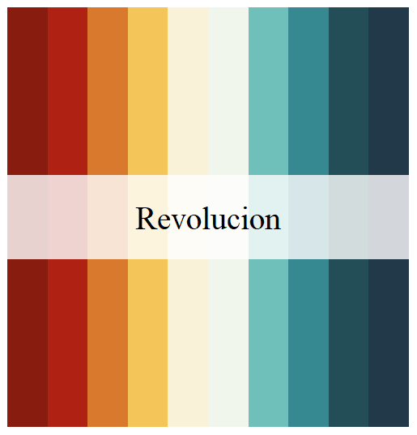
```

***

### Olga Costa

#### Naturaleza

This palette is called `Naturaleza`.

```{r naturaleza, echo=FALSE, out.width="400px", fig.cap="Naturaleza"}
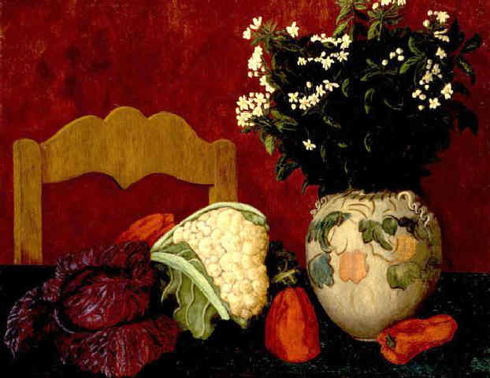
```

```{r naturaleza-palette, echo=FALSE, out.width="185px", fig.cap="Naturaleza"}
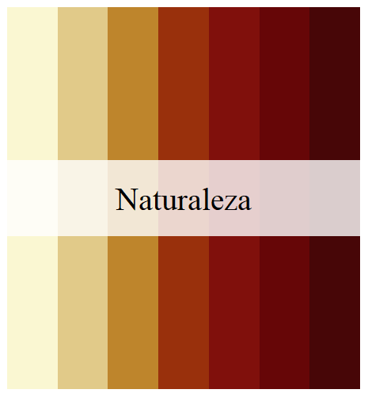
```

#### Ofrenda

This palette is called `Ofrenda`.

```{r ofrenda, echo=FALSE, out.width="400px", fig.cap="Ofrenda"}
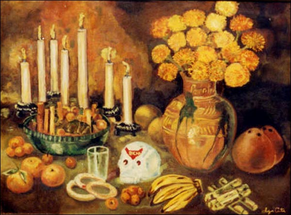
```

```{r ofrenda-palette, echo=FALSE, out.width="185px", fig.cap="Ofrenda"}
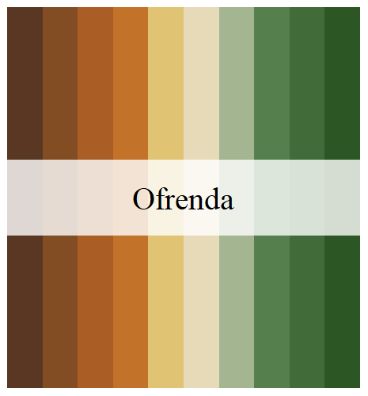
```

#### Vendedora

This palette is called `Vendedora`.

```{r vendedora, echo=FALSE, out.width="400px", fig.cap="Vendedora"}
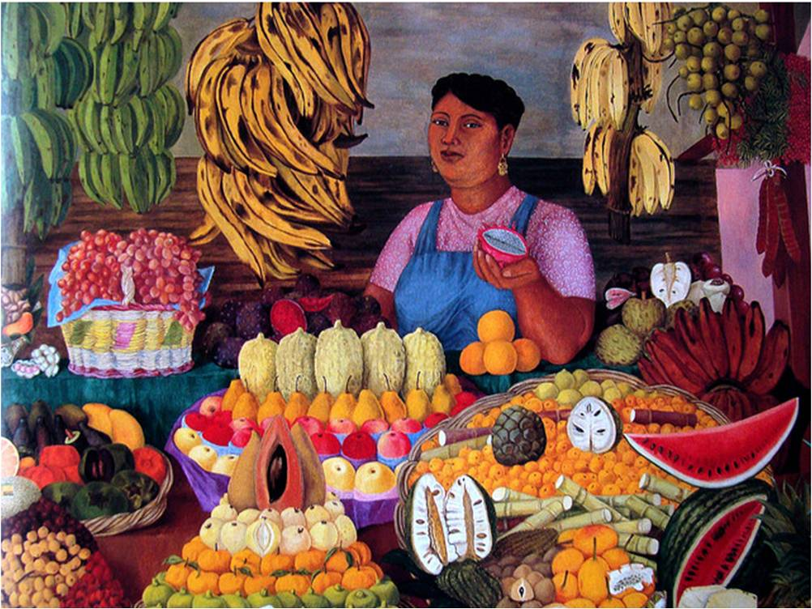
```

```{r vendedora-palette, echo=FALSE, out.width="185px", fig.cap="Vendedora"}
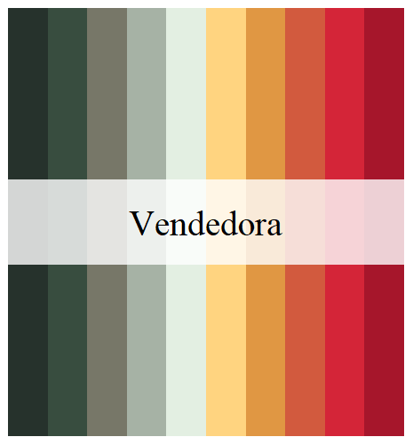
```

***

### María Izquierdo

#### Alacena

This palette is called `Alacena`.

```{r alacena, echo=FALSE, out.width="400px", fig.cap="Alacena"}
knitr::include_graphics("man/figures/maria_izquierdo_alacena.jpg")
```

```{r alacena-palette, echo=FALSE, out.width="185px", fig.cap="Alacena"}
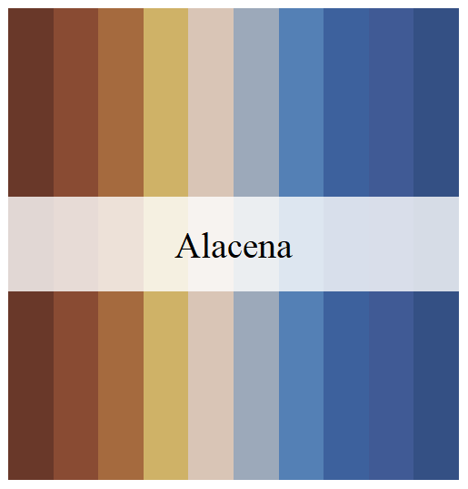
```

#### La Tierra

This palette is called `Tierra`.

```{r tierra, echo=FALSE, out.width="400px", fig.cap="Tierra"}
knitr::include_graphics("man/figures/maria_izquierdo_tierra.jpg")
```

```{r tierra-palette, echo=FALSE, out.width="185px", fig.cap="Tierra"}
knitr::include_graphics("man/figures/tierra.png")
```

***

### Frida Khalo

#### La Casa Azul

These palettes are called `Casita1`, `Casita2`, and `Casita3`. They are inspired by the colors of [Frida's home](https://www.museofridakahlo.org.mx/museo/) in Coyoacán, Mexico City.

```{r casa-azul-1, echo=FALSE, out.width="400px", fig.cap="Casa Azul"}
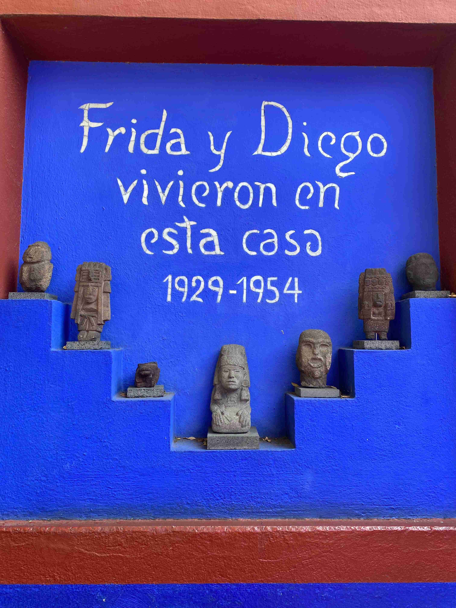
```

```{r casa-azul-2, echo=FALSE, out.width="400px", fig.cap="Casa Azul"}
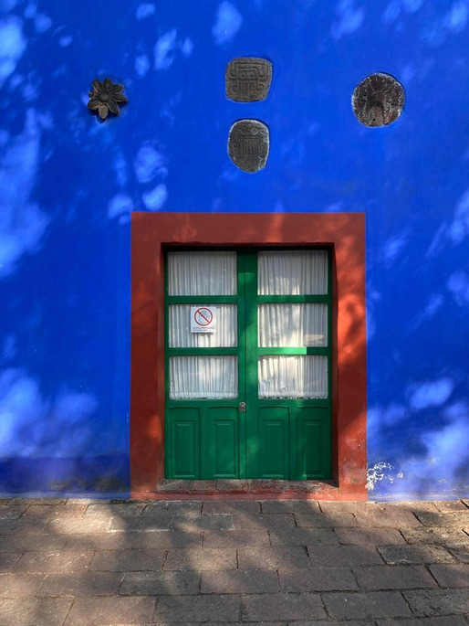
```

```{r casa-azul-3, echo=FALSE, out.width="400px", fig.cap="Casa Azul"}
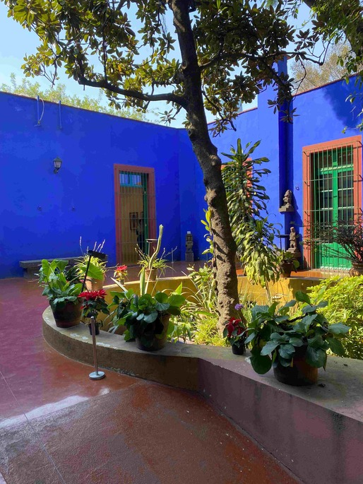
```

```{r casa-azul-4, echo=FALSE, out.width="400px", fig.cap="Casa Azul"}
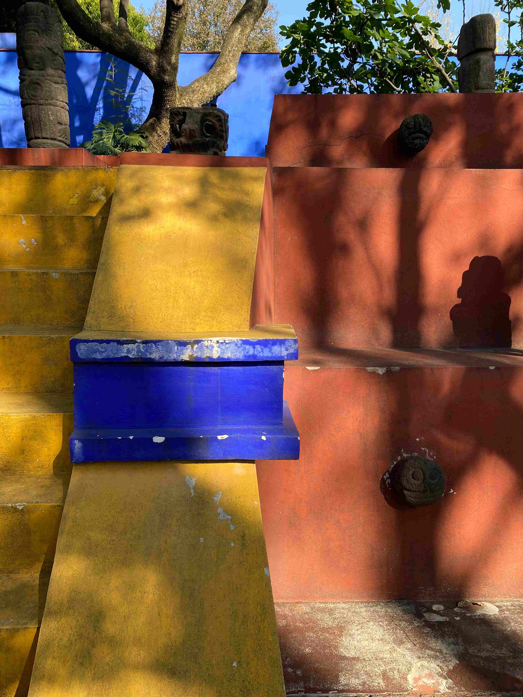
```

```{r casa-azul-5, echo=FALSE, out.width="400px", fig.cap="Casa Azul"}
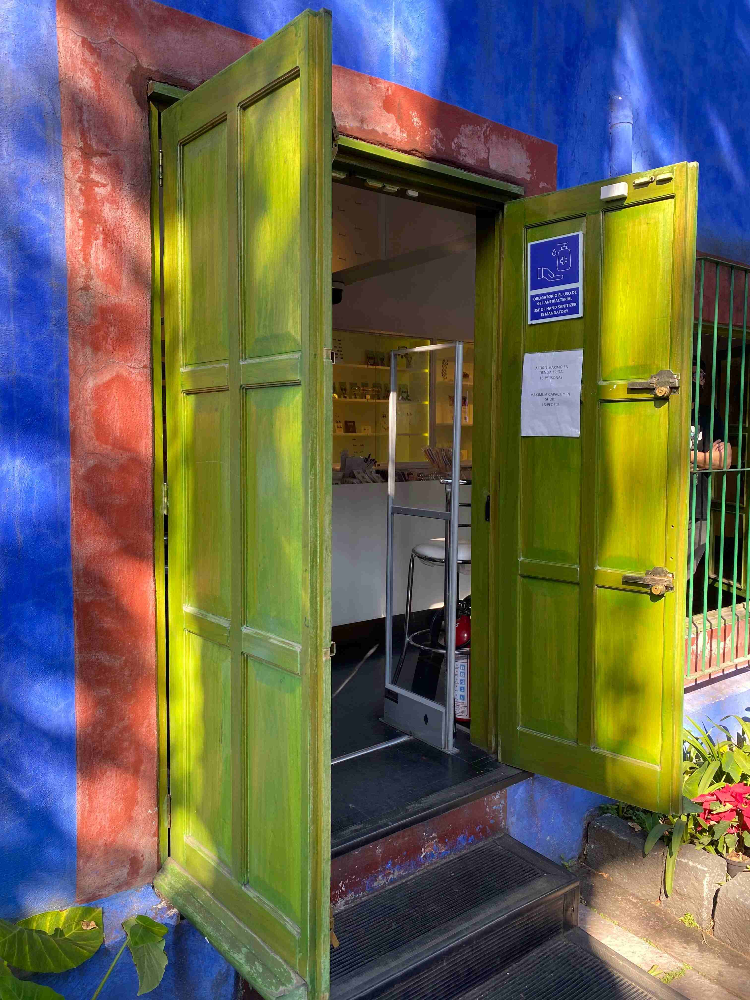
```

```{r casa-azul-6, echo=FALSE, out.width="400px", fig.cap="Casa Azul"}
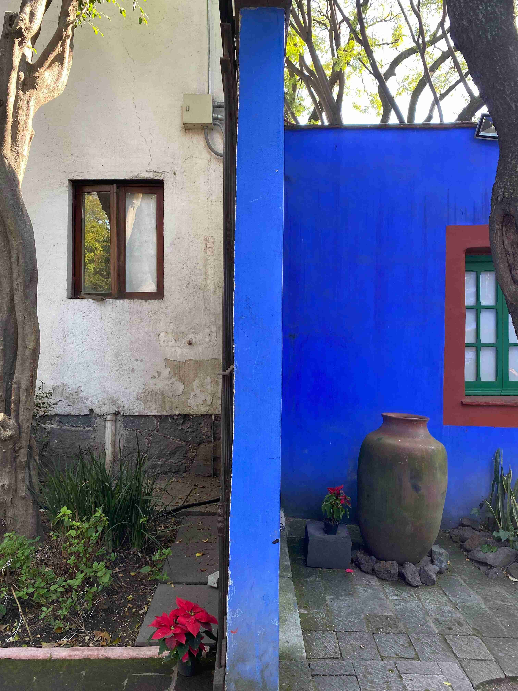
```

```{r casita-1-palette, echo=FALSE, out.width="185px", fig.cap="Casita1"}
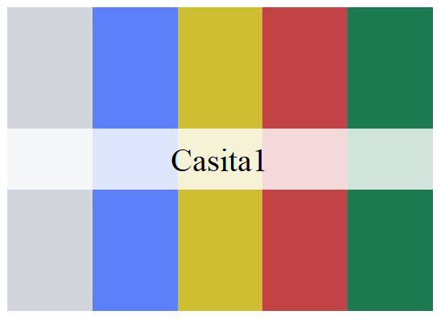
```

```{r casita-2-palette, echo=FALSE, out.width="185px", fig.cap="Casita2"}
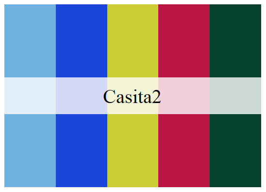
```

```{r casita-3-palette, echo=FALSE, out.width="185px", fig.cap="Casita3"}
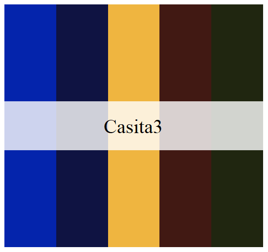
```

***

### Rina Lazo

#### Venerable Abuelo Maiz

This palette is called `Maiz`.

```{r maiz, echo=FALSE, out.width="400px", fig.cap="Maiz"}
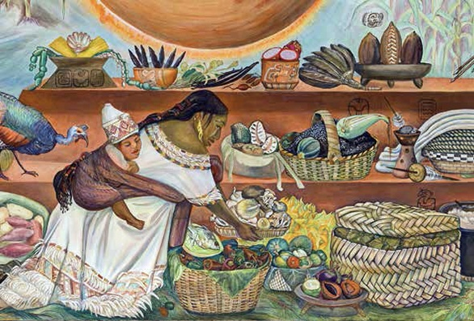
```

```{r maiz-palette, echo=FALSE, out.width="185px", fig.cap="Maiz"}
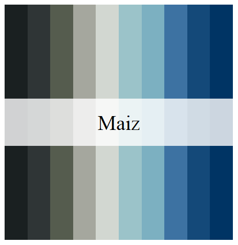
```

***

### Fanny Rabel

#### La Ronda del Tiempo

This palette is called `Ronda`.

```{r ronda, echo=FALSE, out.width="400px", fig.cap="Ronda"}
knitr::include_graphics("man/figures/fanny_rabel_ronda.jpg")
```

```{r ronda-palette, echo=FALSE, out.width="185px", fig.cap="Ronda"}
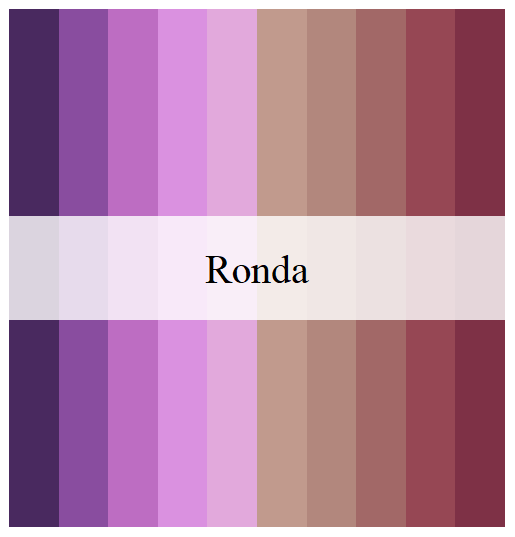
```

***

### Aurora Reyes

#### El atentado a las maestras rurales

This palette is called `Atentado`.

```{r echo=FALSE, out.width="400px", fig.cap="Aurora, Concha, y Frida"}
knitr::include_graphics("man/figures/aurora_reyes_atentado.jpeg")
```

```{r echo=FALSE, out.width="185px", fig.cap="Aurora"}
knitr::include_graphics("man/figures/atentado.png")
```

#### Aurora, Concha, y Frida

This work of Aurora Rivera inspired three palettes, called `Aurora`, `Concha`, and `Frida`.

```{r auroa-concha-frida, echo=FALSE, out.width="400px", fig.cap="Aurora, Concha, y Frida"}
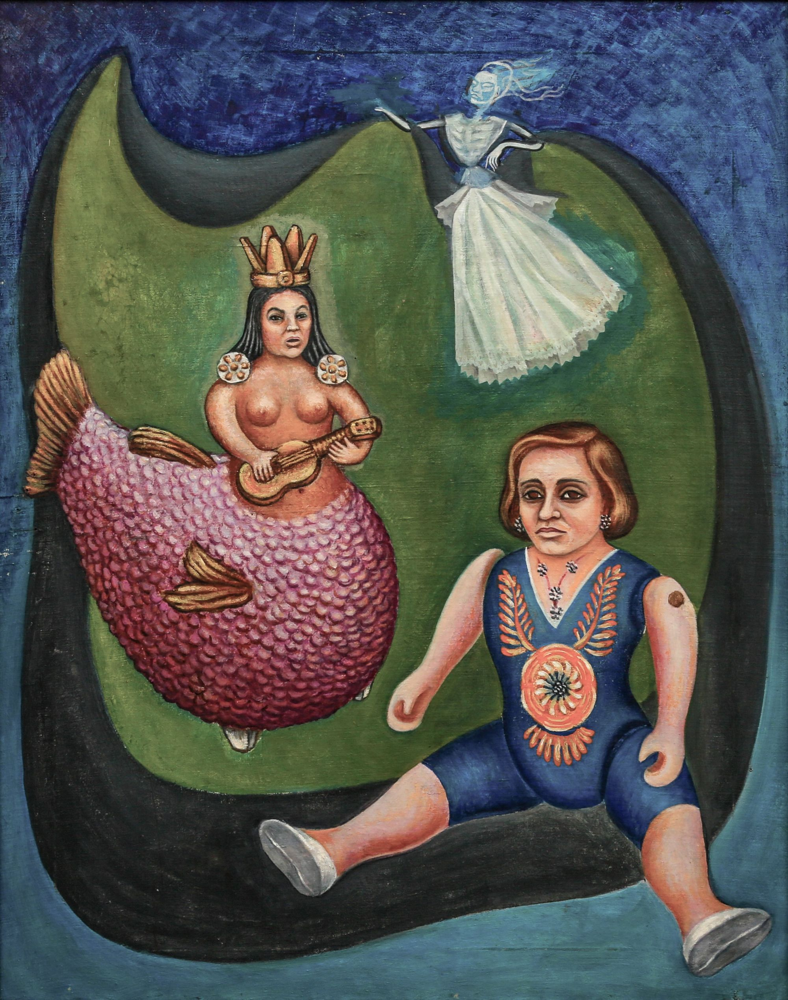
```

```{r aurora-palette, echo=FALSE, out.width="185px", fig.cap="Aurora"}
knitr::include_graphics("man/figures/aurora.png")
```

```{r concha-palette, echo=FALSE, out.width="185px", fig.cap="Concha"}
knitr::include_graphics("man/figures/concha.png")
```

```{r frida-palette, echo=FALSE, out.width="185px", fig.cap="Frida"}
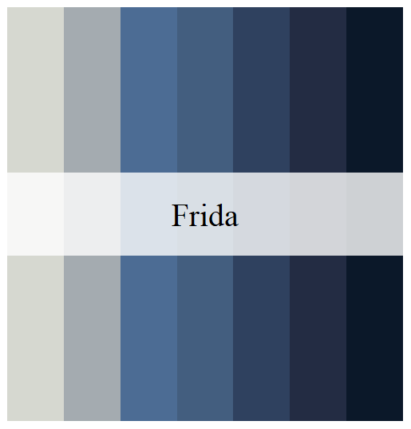
```
***

### Remedios Varo

#### La Huida

This palette is called `Huida`.

```{r echo=FALSE, out.width="400px", fig.cap="La Huida"}
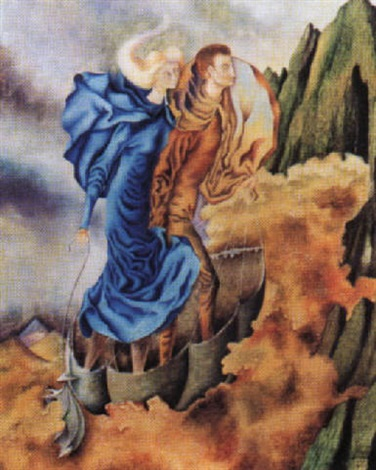
```

```{r echo=FALSE, out.width="185px", fig.cap="Huida"}
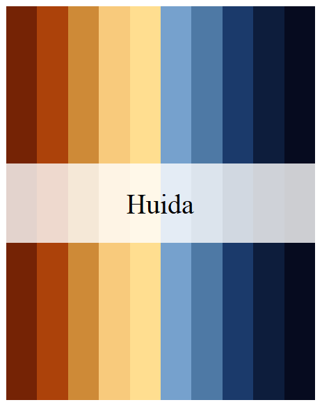
```

#### Taurus

This work of Remedios Varo inspired two palettes, called `Taurus1` and `Taurus2`.

```{r Taurus, echo=FALSE, out.width="400px", fig.cap="Taurus"}
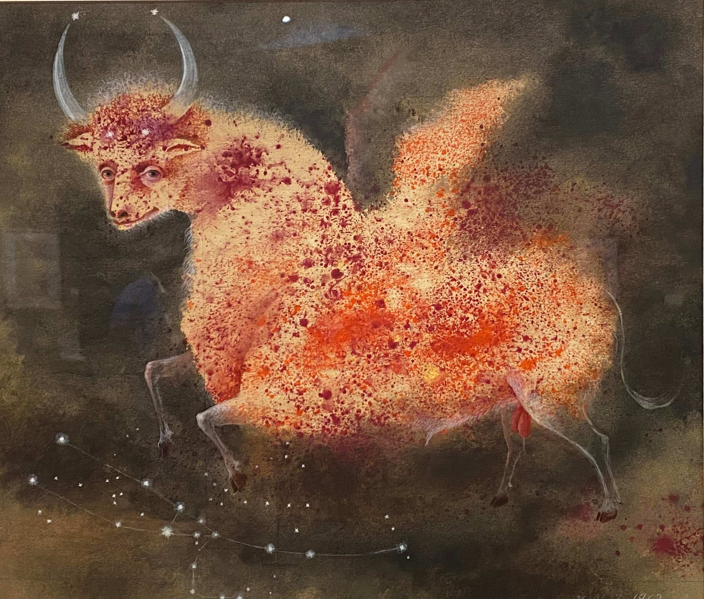
```

```{r taurus1-palette, echo=FALSE, out.width="185px", fig.cap="Taurus1"}
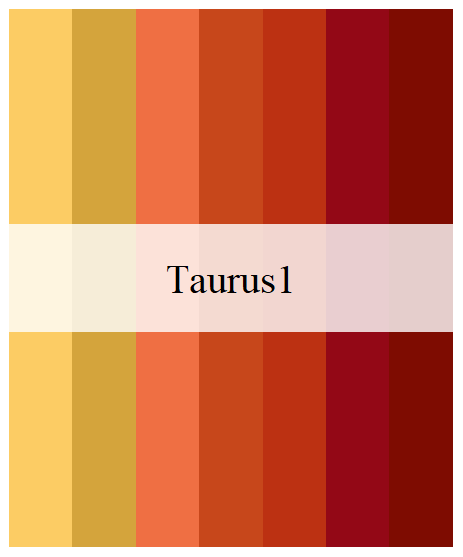
```

```{r taurus2-palette, echo=FALSE, out.width="185px", fig.cap="Taurus2"}
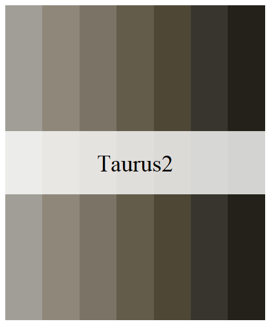
```

***

## Examples 

```{r load-packges, message=FALSE, warning=FALSE}
library(aRtsy) # Koen Derks' package for generative art 
library(flametree) # Danielle Navarro's package for generative art
library(MexBrewer)
library(sf)
library(tidyverse)
```

Invoke data sets used in the examples:
```{r load-data}
data("mx_estados") # Simple features object with the boundaries of states in Mexico
data("df_mxstate_2020") # Data from {mxmaps }with population statistics at the state level
```

Join population statistics to state boundaries:
```{r prepare-data}
mx_estados <- mx_estados |>
  left_join(df_mxstate_2020 |>
              #Percentage of population that speak an indigenous language
              mutate(pct_ind_lang = indigenous_language/pop * 100) |> 
              dplyr::transmute(pop2020 = pop,
                               am2020 = afromexican,
                               state_name, 
                               pct_ind_lang),
            by = c("nombre" = "state_name"))
```

Distribution of population by geographic region in Mexico:
```{r population-distribution}
ggplot(data = mx_estados,
       aes(x = region, y = pop2020, fill = region)) +
  geom_boxplot() +
  scale_fill_manual(values = mex.brewer("Concha", n = 5)) +
  theme_minimal()
```

Percentage of population who speak an indigenous language in 2020 by state:
```{r indigenous-languages}
ggplot() +
  geom_sf(data = mx_estados,
          aes(fill = pct_ind_lang),
          color = "white",
          size = 0.08) +
  scale_fill_gradientn(colors = mex.brewer("Tierra")) +
  theme_minimal()
```

# Some Rtistry

### Danielle Navarro's [{flametree}](https://github.com/djnavarro/flametree)

The following three images were created using the {flametree} package.

```{r flametree-1, cache=TRUE}
# pick some colours
shades <- MexBrewer::mex.brewer("Vendedora") |>
  as.vector()

# data structure defining the trees
dat <- flametree_grow(seed = 3563,
                      time = 11, 
                      trees = 10)

# draw the plot
dat |> 
  flametree_plot(
    background = shades[1],
    palette = shades[2:length(shades)], 
    style = "nativeflora"
  )
```

```{r flametree-2, cache=TRUE}
# pick some colours
shades <- MexBrewer::mex.brewer("Concha") |>
  as.vector()

# data structure defining the trees
dat <- flametree_grow(seed = 3536,
                      time = 8, 
                      trees = 6)

# draw the plot
dat |> 
  flametree_plot(
    background = shades[1],
    palette = rev(shades[2:length(shades)]), 
    style = "wisp"
  )
```

```{r flametree-3, cache=TRUE}
# pick some colours
shades <- MexBrewer::mex.brewer("Maiz") |>
  as.vector()

# data structure defining the trees
dat <- flametree_grow(seed = 3653,
                      time = 8, 
                      trees = 6)

# draw the plot
dat |> 
  flametree_plot(
    background = shades[1],
    palette = shades[2:length(shades)], 
    style = "minimal"
  )
```

### Koen Derks's [aRtsy](https://github.com/koenderks/aRtsy)

The following three images were created using the {aRtsy} package.

Functions:
```{r aRtsy-1, cache=TRUE}
my_formula <- list(
  x = quote(runif(1, -1, 1) * x_i^2 - sin(y_i^2)),
  y = quote(runif(1, -1, 1) * y_i^3 - cos(x_i^2))
)

canvas_function(colors = mex.brewer("Atentado"), 
                polar = FALSE,
                by = 0.005,
                formula = my_formula)
```

Mosaic:
```{r aRtsy-2, cache=TRUE}
canvas_squares(colors = mex.brewer("Alacena"), 
               cuts = 20,
               ratio = 1.5,
               resolution = 200,
               noise = TRUE)
```

Mandelbrot's set:
```{r aRtsy-3, cache=TRUE}
canvas_mandelbrot(colors = mex.brewer("Naturaleza"), 
                  zoom = 8,
                  iterations = 200,
                  resolution = 500)
```

### Meghan S. Harris's [waves](https://thetidytrekker.com/rtistry.html)

These plots are adaptations of Meghan Harris's artsy waves. Create data frames with wave functions:
```{r}
##Set up the "range" on the x axis for horizontal waves=====
wave_theta <- seq(from = -pi,
                  to = -0, 
                  by = 0.01) 

# Create waves using functions
wave_1 <- data.frame(x = wave_theta) |> 
  mutate(y = (sin(x) * cos(2 * wave_theta) + exp(x * 2)))

wave_2 <- data.frame(x = wave_theta) |>
  mutate(y = (0.5 * sin(x) * cos(2.0 * wave_theta) + exp(x)) - 0.5)
```

<!--

```{r}
ggplot() +
  geom_ribbon(data = wave_1,
              aes(x, min = y - 0.025, 
                  ymax = y + 0.025),
              color = "black",
              fill = "orange") +
  geom_ribbon(data = wave_2,
              aes(x, min = y - 0.025, 
                  ymax = y + 0.025),
              color = "black",
              fill = "blue")
```

-->

Define a function to convert a single wave into a set of `n` waves. The function takes a data frame with a wave function and returns a data frame with `n` waves:
```{r}
# Creating a function for iterations====

wave_maker <- function(wave_df, n, shift){
  
  #Create an empty list to store our multiple dataframes(waves)#
  wave_list<- list()
  
  #Create a for loop to iteratively make "n" waves shifted a distance `shift` from each other #
  for(i in seq_along(1:n)){
    
    wave_list[[i]] <- wave_df |>
      mutate(y = y - (shift * i),
             group = i)  
  }
  
  #return the completed data frame to the environment#
  return(bind_rows(wave_list))
}
```

Create layered waves using the data frames with the wave functions above:
```{r}
wave_layers <- rbind(wave_1 |>
                       wave_maker(n = 5, 
                                  shift = 0.075),
                     wave_2 |>
                       wave_maker(n = 5, 
                                  shift = 0.075) |>
                       mutate(group = group + 5)) # adjust the group counter to identify waves uniquely
```

Plot layered waves using cartesian coordinates and palette `Ofrenda`:
```{r}
ggplot(wave_layers) +
  geom_rect(aes(xmin = -pi, 
                xmax = -0.0, 
                ymin = min(y) - 0.50,
                ymax = max(y) + 0.30 ),
            size = 2.5,
            color = mex.brewer("Ofrenda")[6],
            fill = mex.brewer("Ofrenda")[4]) +
  geom_rect(aes(xmin = -pi, 
                xmax = -0.0, 
                ymin = min(y) - 0.50,
                ymax = max(y) + 0.30 ),
            size = 1,
            color = "black",
            fill = NA) +
  geom_ribbon(aes(x, 
                  ymin = y - 0.025 * 4 * x,
                  ymax = y + 0.015 * 10 * x, 
                  group = group, 
                  fill = group),
              color = "black",
              size = 0.5) + 
  scale_fill_gradientn(colors = mex.brewer("Ofrenda"))+
  theme_void() +
  theme(legend.position = "none")
```

Plot layered waves using polar coordinates and palette `Atentado`:
```{r}
ggplot(wave_layers) +
  geom_rect(aes(xmin = -pi, 
                xmax = -0.0, 
                ymin = min(y) - 0.45,
                ymax = max(y) + 0.30 ),
            size = 2.5,
            color = mex.brewer("Atentado")[6],
            fill = mex.brewer("Atentado")[3]) +
  geom_rect(aes(xmin = -pi, 
                xmax = -0.0, 
                ymin = min(y) - 0.45,
                ymax = max(y) + 0.30 ),
            size = 1,
            color = "black",
            fill = NA) +
  geom_ribbon(aes(x, 
                  ymin = y - 0.025 * 4 * x,
                  ymax = y + 0.015 * 10 * x, 
                  group = group, 
                  fill = group),
              color = "black",
              size = 0.5) + 
  scale_fill_gradientn(colors = mex.brewer("Atentado")) +
  coord_polar(theta = "x",  
              start = 0, 
              direction = 1, 
              clip = "on") +
  theme_void() +
  theme(legend.position = "none")
```
