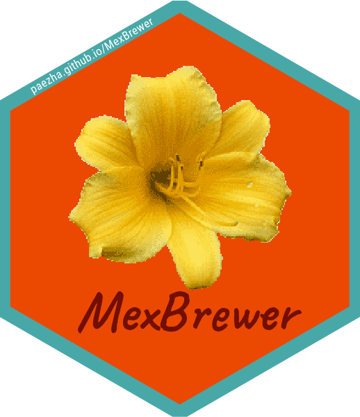

<!-- README.md is generated from README.Rmd. Please edit that file -->

```{r, include = FALSE}
knitr::opts_chunk$set(
  collapse = TRUE,
  comment = "#>",
  fig.path = "man/figures/README-",
  out.width = "100%"
)
```

# MexBrewer 

<!-- badges: start -->
<!-- badges: end -->

MexBrewer is a package with color palettes inspired by the works of Mexican muralists. I was inspired to develop this package by [{MetBrewer}](https://github.com/BlakeRMills/MetBrewer) by [Blake Mills](brm2143@columbia.edu). The structure of the package and coding, like {MetBrewer}, is based on [{PNWColors}](https://github.com/jakelawlor/PNWColors) and [{wesanderson}](https://github.com/karthik/wesanderson).

## Installation

Currently, there is only a development version of {MexBrewer}, which can be installed like so:

``` r
if (!require("remotes")) install.packages("remotes")
remotes::install_github("paezha/MexBrewer") 
```

# Artists

## Aurora Reyes

### El atentado a las maestras rurales

This palette is called `Atentado`.

```{r echo=FALSE, out.width="400px", fig.cap="El atentado a las maestras rurales"}
knitr::include_graphics("man/figures/aurora_reyes_atentado.jpeg")
```

```{r echo=FALSE, out.width="185px", fig.cap="Atentado"}
knitr::include_graphics("man/figures/atentado.png")
```


***
