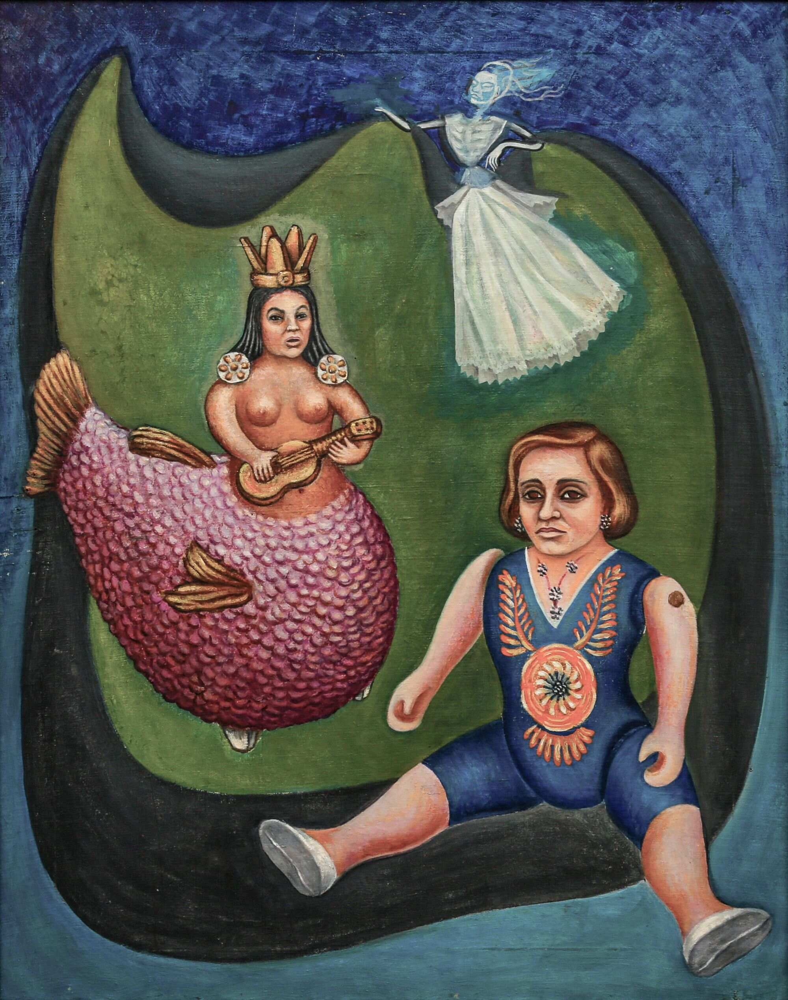
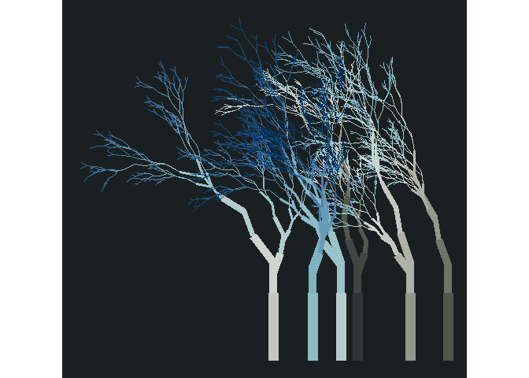
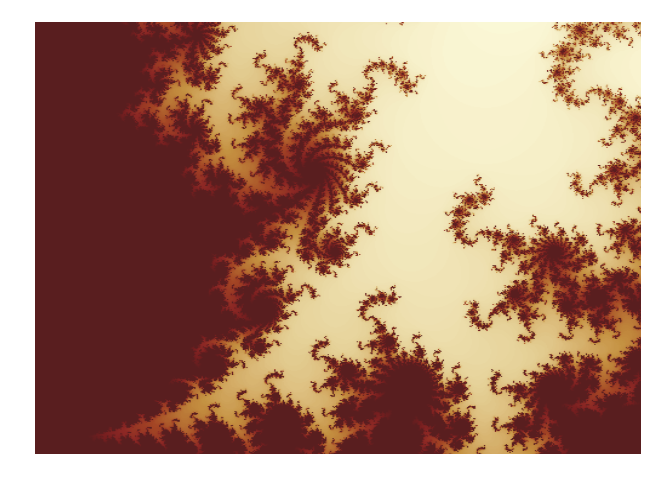

<!-- README.md is generated from README.Rmd. Please edit that file -->

# MexBrewer [](https://paezha.github.io/MexBrewer/)

<!-- badges: start -->
<!-- badges: end -->

MexBrewer is a package with color palettes inspired by the works of
Mexican muralists. The inspiration for this package was
[{MetBrewer}](https://github.com/BlakeRMills/MetBrewer) by [Blake
Mills](brm2143@columbia.edu). The structure of the package and coding,
like {MetBrewer}, is based on
[{PNWColors}](https://github.com/jakelawlor/PNWColors) and
[{wesanderson}](https://github.com/karthik/wesanderson).

## Installation

Currently, there is only a development version of {MexBrewer}, which can
be installed like so:

``` r
if (!require("remotes")) install.packages("remotes")
remotes::install_github("paezha/MexBrewer") 
```

## Artists

### Aurora Reyes

#### El atentado a las maestras rurales

This palette is called `Atentado`.


#### Aurora, Concha, y Frida

This work of Aurora Rivera inspired three palettes, called `Aurora`,
`Concha`, and `Frida`.




------------------------------------------------------------------------

### María Izquierdo

#### Alacena

This palette is called `Alacena`.


#### La Tierra

This palette is called `Tierra`.


------------------------------------------------------------------------

## Examples

``` r
library(aRtsy) # Ijeamaka Anyene's package for generative art 
library(flametree) # Danielle Navarro's package for generative art
library(MexBrewer)
library(mxmaps)
library(sf)
library(tidyverse)
```

Invoke data sets used in the examples:

``` r
data("mx_estados") # Simple features object with the boundaries of states in Mexico
data("df_mxstate_2020") # Data from {mxmaps }with population statistics at the state level
```

Join population statistics to state boundaries:

``` r
mx_estados <- mx_estados %>%
  left_join(df_mxstate_2015%>%
              dplyr::transmute(pop2015 = pop, # Population by state in 2015
                               am2015 = afromexican, # Afromexican population by state in 2015
                               state_name),
            by = c("nombre" = "state_name")) %>%
  left_join(df_mxstate_2020 %>%
              #Percentage of population that speak an indigenous language
              mutate(pct_ind_lang = indigenous_language/pop * 100) %>% 
              dplyr::transmute(pop2020 = pop,
                               am2020 = afromexican,
                               state_name, 
                               pct_ind_lang),
            by = c("nombre" = "state_name")) %>%
  # Calculate the change in popualtion and afromexican population between 2015 and 2020
  mutate(delta_pop = (pop2020 - pop2015)/pop2015,
         delta_am = (am2020 - am2015)/am2015)
```

Distribution of population by geographic region in Mexico:

``` r
ggplot(data = mx_estados,
       aes(x = region, y = pop2015, fill = region)) +
  geom_boxplot() +
  scale_fill_manual(values = mex.brewer("Concha", n = 5)) +
  theme_minimal()
```


Percentage of population who speak an indigenous language in 2020 by
state:

``` r
ggplot() +
  geom_sf(data = mx_estados,
          aes(fill = pct_ind_lang),
          color = "white",
          size = 0.08) +
  scale_fill_gradientn(colors = mex.brewer("Tierra")) +
  theme_minimal()
```


Percentage change of population by state between 2015 and 2020:

``` r
ggplot() +
  geom_sf(data = mx_estados,
          aes(fill = delta_pop),
          color = "white",
          size = 0.08) +
  scale_fill_gradientn(colors = mex.brewer("Atentado")) +
  theme_minimal()
```


Percentage change of afromexican population by state between 2015 and
2020:

``` r
ggplot() +
  geom_sf(data = mx_estados,
          aes(fill = delta_am),
          color = "white",
          size = 0.08) +
  scale_fill_gradientn(colors = mex.brewer("Alacena")) +
  theme_minimal()
```


# Some Rtistry

### Danielle Navarro’s [{flametree}](https://github.com/djnavarro/flametree)

The following three images were created using the {flametree} package.

``` r
# pick some colours
shades <- MexBrewer::mex.brewer("Tierra") %>%
  as.vector()

# data structure defining the trees
dat <- flametree_grow(seed = 3563,
                      time = 11, 
                      trees = 10)

# draw the plot
dat %>% 
  flametree_plot(
    background = shades[1],
    palette = shades[2:length(shades)], 
    style = "nativeflora"
  )
```


``` r
# pick some colours
shades <- MexBrewer::mex.brewer("Concha") %>%
  as.vector()

# data structure defining the trees
dat <- flametree_grow(seed = 3536,
                      time = 8, 
                      trees = 6)

# draw the plot
dat %>% 
  flametree_plot(
    background = shades[1],
    palette = rev(shades[2:length(shades)]), 
    style = "wisp"
  )
```


``` r
# pick some colours
shades <- MexBrewer::mex.brewer("Frida") %>%
  as.vector()

# data structure defining the trees
dat <- flametree_grow(seed = 3653,
                      time = 8, 
                      trees = 6)

# draw the plot
dat %>% 
  flametree_plot(
    background = shades[1],
    palette = shades[2:length(shades)], 
    style = "minimal"
  )
```



### Koen Derks’s [aRtsy](https://github.com/koenderks/aRtsy)

The following three images were created using the {aRtsy} package.

``` r
my_formula <- list(
  x = quote(runif(1, -1, 1) * x_i^2 - sin(y_i^2)),
  y = quote(runif(1, -1, 1) * y_i^3 - cos(x_i^2))
)

canvas_function(colors = mex.brewer("Atentado"), 
                polar = FALSE,
                by = 0.005,
                formula = my_formula)
```


``` r
canvas_squares(colors = mex.brewer("Alacena"), 
                cuts = 20,
                ratio = 1.5,
                resolution = 200,
               noise = TRUE)
```


``` r
canvas_mandelbrot(colors = mex.brewer("Atentado"), 
                  zoom = 8,
                iterations = 200,
               resolution = 500)
```


