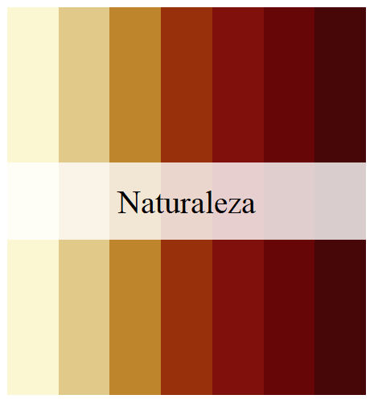
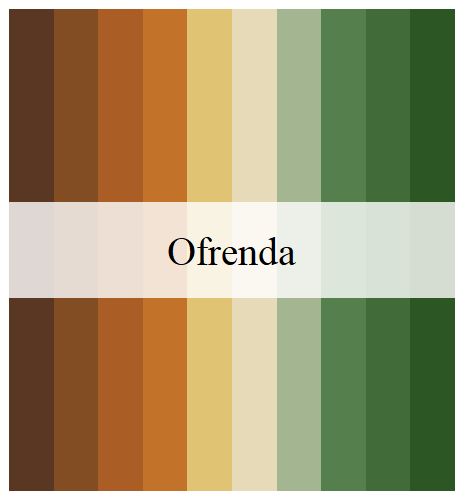
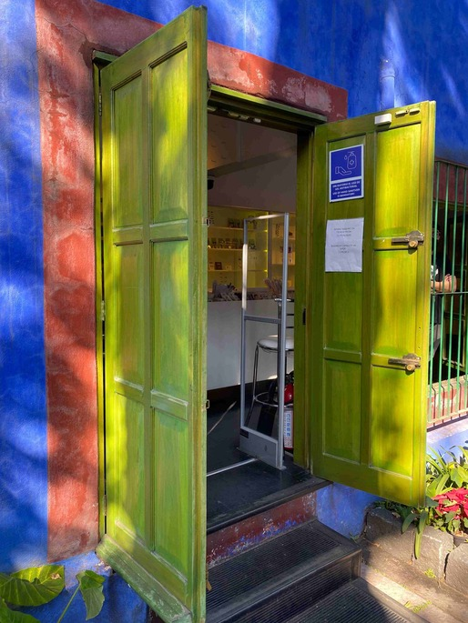
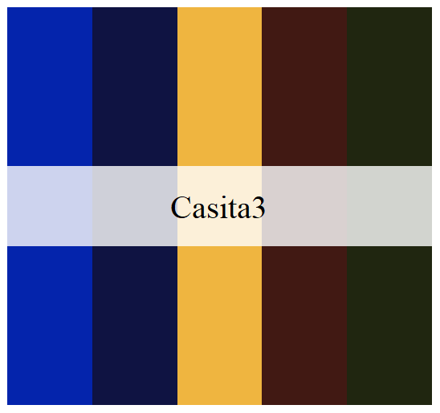
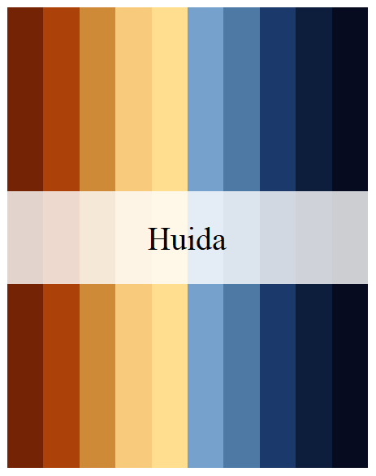
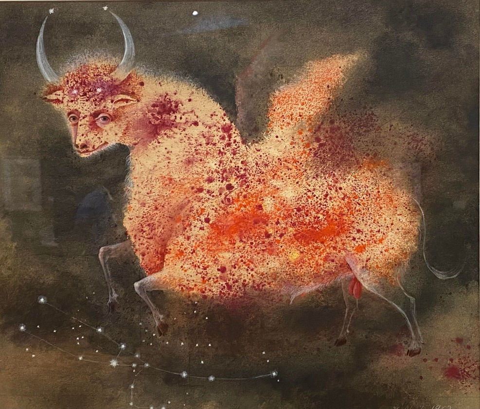
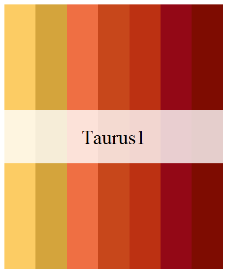
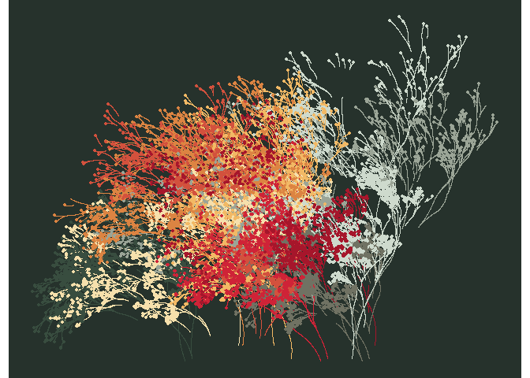

<!-- README.md is generated from README.Rmd. Please edit that file -->

# MexBrewer [](https://paezha.github.io/MexBrewer/)

<!-- badges: start -->

[](https://CRAN.R-project.org/package=MexBrewer)

[](https://lifecycle.r-lib.org/articles/stages.html#stable)

[](https://github.com/paezha/MexBrewer/stargazers)

  


<!-- badges: end -->

MexBrewer is a package with color palettes inspired by the works of
Mexican painters and muralists. This package was motivated and draws
heavily from the code of [Blake R.
Mills](https://github.com/BlakeRMills/)’s
[{MetBrewer}](https://github.com/BlakeRMills/MetBrewer), the package
with color palettes form the Metropolitan Museum of Art of New York. The
structure of the package and coding, like {MetBrewer}, are based on
[{PNWColors}](https://github.com/jakelawlor/PNWColors) and
[{wesanderson}](https://github.com/karthik/wesanderson).

## Installation

The package is available from CRAN:

``` r
install.packages("MexBrewer")
```

The development version of the package can be installed like so:

``` r
if (!require("remotes")) install.packages("remotes")
remotes::install_github("paezha/MexBrewer") 
```

## Artists

### Electa Arenal

#### Revolución

This palette is called `Revolucion`.

<div class="figure">


<p class="caption">
Revolucion
</p>

</div>

<div class="figure">


<p class="caption">
Revolucion
</p>

</div>

------------------------------------------------------------------------

### Olga Costa

#### Naturaleza

This palette is called `Naturaleza`.

<div class="figure">


<p class="caption">
Naturaleza
</p>

</div>

<div class="figure">


<p class="caption">
Naturaleza
</p>

</div>

#### Ofrenda

This palette is called `Ofrenda`.

<div class="figure">


<p class="caption">
Ofrenda
</p>

</div>

<div class="figure">


<p class="caption">
Ofrenda
</p>

</div>

#### Vendedora

This palette is called `Vendedora`.

<div class="figure">


<p class="caption">
Vendedora
</p>

</div>

<div class="figure">


<p class="caption">
Vendedora
</p>

</div>

------------------------------------------------------------------------

### María Izquierdo

#### Alacena

This palette is called `Alacena`.

<div class="figure">


<p class="caption">
Alacena
</p>

</div>

<div class="figure">


<p class="caption">
Alacena
</p>

</div>

#### La Tierra

This palette is called `Tierra`.

<div class="figure">


<p class="caption">
Tierra
</p>

</div>

<div class="figure">


<p class="caption">
Tierra
</p>

</div>

------------------------------------------------------------------------

### Frida Khalo

#### La Casa Azul

These palettes are called `Casita1`, `Casita2`, and `Casita3`. They are
inspired by the colors of [Frida’s
home](https://www.museofridakahlo.org.mx/museo/) in Coyoacán, Mexico
City.

<div class="figure">


<p class="caption">
Casa Azul
</p>

</div>

<div class="figure">


<p class="caption">
Casa Azul
</p>

</div>

<div class="figure">


<p class="caption">
Casa Azul
</p>

</div>

<div class="figure">


<p class="caption">
Casa Azul
</p>

</div>

<div class="figure">


<p class="caption">
Casa Azul
</p>

</div>

<div class="figure">


<p class="caption">
Casa Azul
</p>

</div>

<div class="figure">


<p class="caption">
Casita1
</p>

</div>

<div class="figure">


<p class="caption">
Casita2
</p>

</div>

<div class="figure">


<p class="caption">
Casita3
</p>

</div>

------------------------------------------------------------------------

### Rina Lazo

#### Venerable Abuelo Maiz

This palette is called `Maiz`.

<div class="figure">


<p class="caption">
Maiz
</p>

</div>

<div class="figure">


<p class="caption">
Maiz
</p>

</div>

------------------------------------------------------------------------

### Fanny Rabel

#### La Ronda del Tiempo

This palette is called `Ronda`.

<div class="figure">


<p class="caption">
Ronda
</p>

</div>

<div class="figure">


<p class="caption">
Ronda
</p>

</div>

------------------------------------------------------------------------

### Aurora Reyes

#### El atentado a las maestras rurales

This palette is called `Atentado`.

<div class="figure">


<p class="caption">
Aurora, Concha, y Frida
</p>

</div>

<div class="figure">


<p class="caption">
Aurora
</p>

</div>

#### Aurora, Concha, y Frida

This work of Aurora Rivera inspired three palettes, called `Aurora`,
`Concha`, and `Frida`.

<div class="figure">


<p class="caption">
Aurora, Concha, y Frida
</p>

</div>

<div class="figure">


<p class="caption">
Aurora
</p>

</div>

<div class="figure">


<p class="caption">
Concha
</p>

</div>

<div class="figure">


<p class="caption">
Frida
</p>

</div>

------------------------------------------------------------------------

### Remedios Varo

#### La Huida

This palette is called `Huida`.

<div class="figure">


<p class="caption">
La Huida
</p>

</div>

<div class="figure">


<p class="caption">
Huida
</p>

</div>

#### Taurus

This work of Remedios Varo inspired two palettes, called `Taurus1` and
`Taurus2`.

<div class="figure">


<p class="caption">
Taurus
</p>

</div>

<div class="figure">


<p class="caption">
Taurus1
</p>

</div>

<div class="figure">


<p class="caption">
Taurus2
</p>

</div>

------------------------------------------------------------------------

## Examples

``` r
library(aRtsy) # Koen Derks' package for generative art 
library(flametree) # Danielle Navarro's package for generative art
library(MexBrewer)
library(sf)
library(tidyverse)
```

Invoke data sets used in the examples:

``` r
data("mx_estados") # Simple features object with the boundaries of states in Mexico
data("df_mxstate_2020") # Data from {mxmaps }with population statistics at the state level
```

Join population statistics to state boundaries:

``` r
mx_estados <- mx_estados |>
  left_join(df_mxstate_2020 |>
              #Percentage of population that speak an indigenous language
              mutate(pct_ind_lang = indigenous_language/pop * 100) |> 
              dplyr::transmute(pop2020 = pop,
                               am2020 = afromexican,
                               state_name, 
                               pct_ind_lang),
            by = c("nombre" = "state_name"))
```

Distribution of population by geographic region in Mexico:

``` r
ggplot(data = mx_estados,
       aes(x = region, y = pop2020, fill = region)) +
  geom_boxplot() +
  scale_fill_manual(values = mex.brewer("Concha", n = 5)) +
  theme_minimal()
```


Percentage of population who speak an indigenous language in 2020 by
state:

``` r
ggplot() +
  geom_sf(data = mx_estados,
          aes(fill = pct_ind_lang),
          color = "white",
          size = 0.08) +
  scale_fill_gradientn(colors = mex.brewer("Tierra")) +
  theme_minimal()
```


# Some Rtistry

### Danielle Navarro’s [{flametree}](https://github.com/djnavarro/flametree)

The following three images were created using the {flametree} package.

``` r
# pick some colours
shades <- MexBrewer::mex.brewer("Vendedora") |>
  as.vector()

# data structure defining the trees
dat <- flametree_grow(seed = 3563,
                      time = 11, 
                      trees = 10)

# draw the plot
dat |> 
  flametree_plot(
    background = shades[1],
    palette = shades[2:length(shades)], 
    style = "nativeflora"
  )
```



``` r
# pick some colours
shades <- MexBrewer::mex.brewer("Concha") |>
  as.vector()

# data structure defining the trees
dat <- flametree_grow(seed = 3536,
                      time = 8, 
                      trees = 6)

# draw the plot
dat |> 
  flametree_plot(
    background = shades[1],
    palette = rev(shades[2:length(shades)]), 
    style = "wisp"
  )
```


``` r
# pick some colours
shades <- MexBrewer::mex.brewer("Maiz") |>
  as.vector()

# data structure defining the trees
dat <- flametree_grow(seed = 3653,
                      time = 8, 
                      trees = 6)

# draw the plot
dat |> 
  flametree_plot(
    background = shades[1],
    palette = shades[2:length(shades)], 
    style = "minimal"
  )
```


### Koen Derks’s [aRtsy](https://github.com/koenderks/aRtsy)

The following three images were created using the {aRtsy} package.

Functions:

``` r
my_formula <- list(
  x = quote(runif(1, -1, 1) * x_i^2 - sin(y_i^2)),
  y = quote(runif(1, -1, 1) * y_i^3 - cos(x_i^2))
)

canvas_function(colors = mex.brewer("Atentado"), 
                polar = FALSE,
                by = 0.005,
                formula = my_formula)
```


Mosaic:

``` r
canvas_squares(colors = mex.brewer("Alacena"), 
               cuts = 20,
               ratio = 1.5,
               resolution = 200,
               noise = TRUE)
```


Mandelbrot’s set:

``` r
canvas_mandelbrot(colors = mex.brewer("Naturaleza"), 
                  zoom = 8,
                  iterations = 200,
                  resolution = 500)
```


### Meghan S. Harris’s [waves](https://thetidytrekker.com/rtistry.html)

These plots are adaptations of Meghan Harris’s artsy waves. Create data
frames with wave functions:

``` r
##Set up the "range" on the x axis for horizontal waves=====
wave_theta <- seq(from = -pi,
                  to = -0, 
                  by = 0.01) 

# Create waves using functions
wave_1 <- data.frame(x = wave_theta) |> 
  mutate(y = (sin(x) * cos(2 * wave_theta) + exp(x * 2)))

wave_2 <- data.frame(x = wave_theta) |>
  mutate(y = (0.5 * sin(x) * cos(2.0 * wave_theta) + exp(x)) - 0.5)
```

<!--


```r
ggplot() +
  geom_ribbon(data = wave_1,
              aes(x, min = y - 0.025, 
                  ymax = y + 0.025),
              color = "black",
              fill = "orange") +
  geom_ribbon(data = wave_2,
              aes(x, min = y - 0.025, 
                  ymax = y + 0.025),
              color = "black",
              fill = "blue")
```


-->

Define a function to convert a single wave into a set of `n` waves. The
function takes a data frame with a wave function and returns a data
frame with `n` waves:

``` r
# Creating a function for iterations====

wave_maker <- function(wave_df, n, shift){
  
  #Create an empty list to store our multiple dataframes(waves)#
  wave_list<- list()
  
  #Create a for loop to iteratively make "n" waves shifted a distance `shift` from each other #
  for(i in seq_along(1:n)){
    
    wave_list[[i]] <- wave_df |>
      mutate(y = y - (shift * i),
             group = i)  
  }
  
  #return the completed data frame to the environment#
  return(bind_rows(wave_list))
}
```

Create layered waves using the data frames with the wave functions
above:

``` r
wave_layers <- rbind(wave_1 |>
                       wave_maker(n = 5, 
                                  shift = 0.075),
                     wave_2 |>
                       wave_maker(n = 5, 
                                  shift = 0.075) |>
                       mutate(group = group + 5)) # adjust the group counter to identify waves uniquely
```

Plot layered waves using cartesian coordinates and palette `Ofrenda`:

``` r
ggplot(wave_layers) +
  geom_rect(aes(xmin = -pi, 
                xmax = -0.0, 
                ymin = min(y) - 0.50,
                ymax = max(y) + 0.30 ),
            size = 2.5,
            color = mex.brewer("Ofrenda")[6],
            fill = mex.brewer("Ofrenda")[4]) +
  geom_rect(aes(xmin = -pi, 
                xmax = -0.0, 
                ymin = min(y) - 0.50,
                ymax = max(y) + 0.30 ),
            size = 1,
            color = "black",
            fill = NA) +
  geom_ribbon(aes(x, 
                  ymin = y - 0.025 * 4 * x,
                  ymax = y + 0.015 * 10 * x, 
                  group = group, 
                  fill = group),
              color = "black",
              size = 0.5) + 
  scale_fill_gradientn(colors = mex.brewer("Ofrenda"))+
  theme_void() +
  theme(legend.position = "none")
```


Plot layered waves using polar coordinates and palette `Atentado`:

``` r
ggplot(wave_layers) +
  geom_rect(aes(xmin = -pi, 
                xmax = -0.0, 
                ymin = min(y) - 0.45,
                ymax = max(y) + 0.30 ),
            size = 2.5,
            color = mex.brewer("Atentado")[6],
            fill = mex.brewer("Atentado")[3]) +
  geom_rect(aes(xmin = -pi, 
                xmax = -0.0, 
                ymin = min(y) - 0.45,
                ymax = max(y) + 0.30 ),
            size = 1,
            color = "black",
            fill = NA) +
  geom_ribbon(aes(x, 
                  ymin = y - 0.025 * 4 * x,
                  ymax = y + 0.015 * 10 * x, 
                  group = group, 
                  fill = group),
              color = "black",
              size = 0.5) + 
  scale_fill_gradientn(colors = mex.brewer("Atentado")) +
  coord_polar(theta = "x",  
              start = 0, 
              direction = 1, 
              clip = "on") +
  theme_void() +
  theme(legend.position = "none")
```


